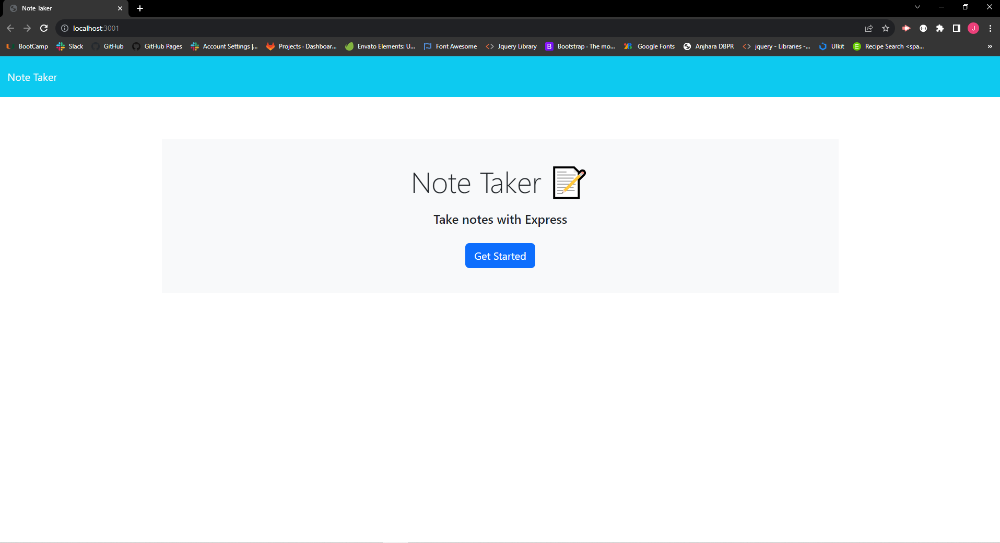
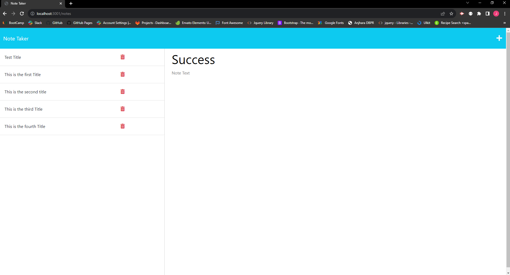

# Note Taker

## Description
Note Taker is an application that can be used to write and save notes. This application uses an Express.js back end and will save and retrieve note data from a JSON file

## Deployment link

<a href="https://notetaker-jb-67ef6c926289.herokuapp.com/">👉Click Here 👈</a>

## Usage

## Licence

THE SOFTWARE IS PROVIDED “AS IS”, WITHOUT WARRANTY OF ANY KIND, EXPRESS OR IMPLIED, INCLUDING BUT NOT LIMITED TO THE WARRANTIES OF MERCHANTABILITY, FITNESS FOR A PARTICULAR PURPOSE AND NONINFRINGEMENT. IN NO EVENT SHALL THE AUTHORS OR COPYRIGHT HOLDERS BE LIABLE FOR ANY CLAIM, DAMAGES OR OTHER LIABILITY, WHETHER IN AN ACTION OF CONTRACT, TORT OR OTHERWISE, ARISING FROM, OUT OF OR IN CONNECTION WITH THE SOFTWARE OR THE USE OR OTHER DEALINGS IN THE SOFTWARE.

## Questions

  <ul>
  <li> <a href="https://github.com/JulioBermudez">GitHub Profile</a></li>
  <li> <a href="mailto:julioph0n3@gmail.com">Email me</a></li>
  </ul>
